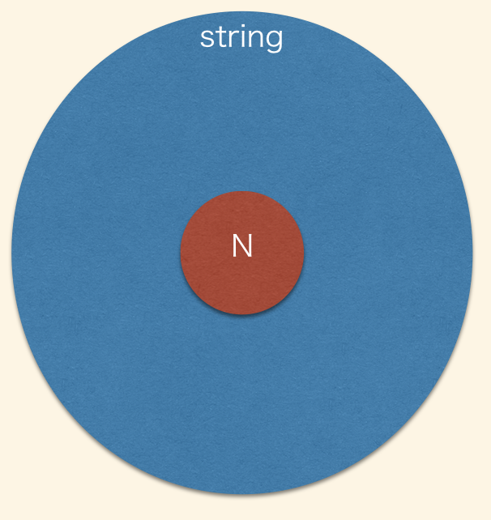

<!-- sectionTitle: catacliの紹介 -->

import { Img } from "@fusuma/client";

## command line parser catacliの紹介

---

## catacli

- [github](https://github.com/akito0107/catacli)
- TypeScript向けに書いたCommand Line Parser(Node.jsでCLI書くときに使うやつ)
    - commander.js, minimist, yargsなどと同じジャンル
- 型推論がかなり強く効く
- [詳しくはこちら](https://speakerdeck.com/akito0107/typescriptfalsekomandorainpasa)
- (名前変えました)

---

## motivation

- commander.js のAPI(Githubより)

```js
const program = require('commander');

program
  .option('-d, --debug', 'output extra debugging')
  .option('-s, --small', 'small pizza size')
  .option('-p, --pizza-type <type>', 'flavour of pizza');

program.parse(process.argv);

if (program.debug) console.log(program.opts());
if (program.small) console.log('- small pizza size');
if (program.pizzaType) console.log(`- ${program.pizzaType}`);
```

- 文字列で `flag` を定義していくスタイル
- flagが増えたときや、subcommandとか増えだすと辛い

### flagを全部型推論させたい！！！

---

## Demo

[playground](https://www.typescriptlang.org/play/#code/JYWwDg9gTgLgBAbxAQwNYFMDKMrAHYDmAYgDbIEA0cU6AJgK4DG6p5AvnAGZQQhwBEjZDGSMSwfgG4AsACg5AegVcyBOGGEx0UPHLmMIeAM7xkUAgDc4AXjgBtfgFpHWk-yr9XMdwOdeATD6e6CaBALp6sgbG8JwAjDZwKBjYuISsBAAUwW4AlPqGJlz+iclYOPjEqtkB-PnyUYXwNEYJtvGZDn4h3h4AFhAE6Pxh9QUx1CEltjQMzBmZ8VSc-rmZZpa5MrJAA)

--- 

## 型のトリック

- ①: String Literalをkeyにしたobjectを返す型
- ②: 可変長引数の型推論

--- 

## ①: String Literalをkeyにしたobjectを返す型

- ユーザが引数に与えた文字列のpropを持ったobjectの型として推論させる

```ts
// --test <number> のflagを定義したい
const f = makeNumberFlag("test");
// resは { test: number; }として推論される
const res = f(["test", "123"])
```

---

- Flag(Parser)の型定義(抜粋)
    - `type Flag` はコマンドライン引数( `process.argv` )を受け取り、parseした結果を返す関数(の型定義)

```ts
type Flag<T, N extends string> = (args: string[]) => ParseResult<T, N>;
type ParseResult<T, N extends string> = {
  [key in N]: {
    value?: T;
  };
};
```

- 実際のFlagParserはこの型を利用して実装されている

```ts
export type NumberFlag<N extends string> = Flag<number, N>;

export function makeNumberFlag<N extends string>(name: N): NumberFlag<N> {
  return (args: string[]) => {
      // ~ parserのlogicが入る ~
    return {
      [name]: { value: parseInt(v, 10) }
    };
  };
}
```

- ポイントは<strong><N extends string\></strong>

---

## TypeScriptのextends

- 特に型パラメータで使われた場合、継承というより、型の制約条件を表すイメージ([参考](https://www.typescriptlang.org/docs/handbook/generics.html))
- `N extends string` の `N` は `string` を継承した型というよりも、 `string` の型に包含される型という認識のほうが近い
- `string literal type` (javascriptのstringの値そのものの型)はstringに包含される

```ts
type A<N extends string> = {};

type B = A<"test">; // OK
type C = A<"test1" | "test2">; // OK
type D = A<string>; // OK
type E = A<123>; // NG
```

<div class="literal">
    
</div>

---

## mapped type

- [参考](https://www.typescriptlang.org/docs/handbook/advanced-types.html#mapped-types)
- `for in` に近い動きをする

```ts
type M<N extends string> = {
    [K in N]: string;
}

type B = M<"test">; // { test: string; }として推論される
type C = M<"test1" | "test2">; // { test1: string; test2: string; }として推論される
type D = M<string>; // { [x: string]: string; }として推論される
```

---

## これらを応用してみる

- TypeScriptの関数の型パラメータは引数の型をcaptureしてくれる[参考](https://www.typescriptlang.org/docs/handbook/generics.html#hello-world-of-generics)
- `type argument inference`

```ts
function makeNamedProps<N extends string>(propName: N): {[key in N]: string; } {
    // 割愛
}

const res = makeNamedProps("test") // {test: string;}として推論される

const res2 = makeNamedProps<string>("test") // {[x: string]: string;}として推論される
```

---

## ②: 可変長引数の型定義

- 任意のflag parserを組み合わせて、複数のflagをparseできるようにしたい
- `reduceFlag` の型定義について

```ts
const argv = ["--test", "test", "--test2", "test2"]

const f1 = makeStringFlag("test") // (arg: string[]) => ({test: string;});
const f2 = makeStringFlag("test2") // (arg: string[]) => ({test2: string;}):

const reduced = reduceFlag(f1, f2) // (args: string[]) => ({test: string; test2: string;});

const res = reduced(argv); // {test: string; test2: string; }と推論させたい
```

---

## 引数が2個の場合

- 任意の関数を2つうけとり、返り値を合成して返す関数
- それぞれの関数の返り値を型パラメータで受け取り,  `intersection type` を用いる

```ts
function mergeFunction<R1, R2>(f1: (x: any) => R1, f2: (x: any) => R2): (x: any)  => R1 & R2 {
    // 割愛
}

const f1 = () => ({test: "test"});
const f2 = () => ({test2: "test2"});

const fm = mergeFunction(f1, f2); // (x: any) => ({test: "test"} & {test2: "test2"}) として推論
```

---

## Flagで書いてみる

- T1 / T2をそれぞれの引数のFlag(Parser)の型パラメータに渡す

```ts
function merge2<T1, T1Name extends string, T2, T2Name extends string>(
  t1: Flag<T1, T1Name>,
  t2: Flag<T2, T2Name>
): Flag<{ [key in T1Name]: T1 } & { [key in T2Name]: T2 }, T1Name | T2Name> {
    // 割愛
}

const f1 = makeStringFlag("test")
const f2 = makeStringFlag("test2")
const merged = merge2(f1, f2);

const res = merged(argv) // {test: string; test2: string;} として推論される
```

---

## 引数が3個の場合　

- 愚直にやるとこう

```ts
function merge3<T1, T1Name extends string, T2, T2Name extends string, T3, T3Name extends string>(
  t1: Flag<T1, T1Name>,
  t2: Flag<T2, T2Name>,
  t3: Flag<T3, T3Name>
): Flag<{ [key in T1Name]: T1 } & { [key in T2Name]: T2 } & { [key in T3Name]: T3 }, T1Name | T2Name | T3Name> {
    // 割愛
}

```

---

## 引数がN個の場合

- 想定される引数の数だけ型定義を書いておく（あるいは生成する）のはひとつのベストプラクティス
- 本当に任意の数の引数を取るような関数の型定義を正しく書くのは <strong>すごく大変</strong> (あとで話します)

--- 

## (参考)yargs

- api styleの違い
- method chain likeなapi

```ts
import * as yargs from 'yargs';

yargs.command('serve', "Start the server.", (argv) => {
    /* ここの関数の返り値がそのままhandlerで推論されるようになる */
    return argv.option('port', {
        describe: "Port to bind on",
        default: "5000",
    }).option('verbose', {
        alias: 'v',
        default: false,
    });
}, (args) => {
    /* argsの */
    if (args.verbose) {
        console.info("Starting the server...");
    }
    (args.port);
});
```

---

## method chainの型定義

- 関数型チックにやろうとするよりはかなり型は書きやすい
- N個の引数のときに苦しまなくても良い
- (あまり使い勝手も変わらない)

```ts
class FlagParser<T extends object> {
    opts: T;

    constructor(init: T) {
        this.opts = init;
    }

    addStringFlag<N extends string>(name: N): FlagParser<T & {[key in N]: string;}> {
        // 割愛
        return <any>this
    }

}

const parser = new FlagParser({});

// {test: string; test2: string}として推論される
const o = parser.addStringFlag("test").addStringFlag("test2").opts;
```

---

## tree shakingとmethod chain

- <strong>(今回はNode.jsのCLIライブラリの話なので関係ない)</strong>
- method chain styleのAPIはtree shakingが効きづらい傾向にある
    - それぞれのmethodを独立してexportするのが難しい
    - side effectsの問題
- 副作用のない関数を組み合わせて機能を作っていくほうがtree shaking的には有利

```ts
export function stringFlag(){}
export function numberFlag(){} // numberFlagは使用されていなければbundle時に消える
```

---

## 可変長引数は諦めきれない

- こうなっちゃう

```ts
f(d, f(c, f(a, b)))
```

- こう書きたい

```ts
f(d, c, b, a);
```