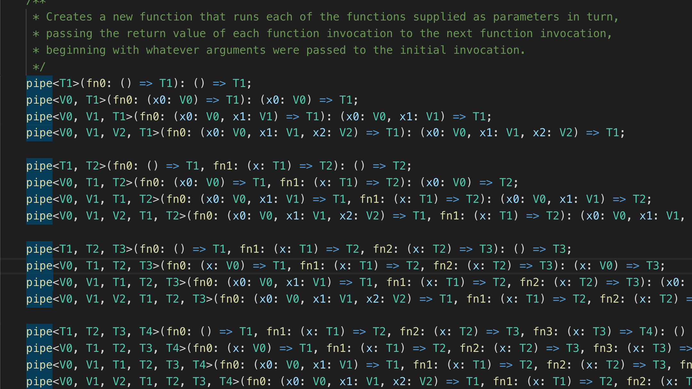

<!-- sectionTitle: 可変長引数の型推論 -->

import { Img } from "@fusuma/client";

## 可変長引数の型推論

---

## pipeNで考えてみる

- 任意の数の関数を受け取り、関数を返す関数

```ts
// (a: number) => stringに推論されてほしい
const piped = pipeN(
    (a: number) => (`${a}`),
    (b: string) => ({key: b}),
    (c: {key: string}) => (c.key),
);
```

- ( `|>` こんな演算子になるかもしれない)

---

## 可変長引数のハンドリング第一歩

- 可変長引数は<strong>tuple</strong>として扱える
- TypeScriptには `tuple` という型がある [参考](https://www.typescriptlang.org/docs/handbook/basic-types.html#tuple)
- Arrayとの違いは、長さが固定であること、それぞれの要素の型が固定されていること

```ts
let x: [string, number];

x = ["hello", 10]; // OK
x = [10, "hello"]; // Error
```

```ts
function<A extends Array<any>> tupleTest(...a: A): A {...}

tupleTest(1, 2, 3, 4, 5) // [number, number, number, number, number]として推論される
```

---

## Tuple操作のイディオムを覚えよう

- Tuple操作の型のイディオムは探すと結構出てくる
- 外部ライブラリを頼るのが良さそう
- [ts-toolbelt](https://github.com/pirix-gh/ts-toolbelt)にだいたい揃ってる

```ts
// Tupleの先頭の要素をとってくる
type Head<T extends Array<any>> = ((...args: T) => any) extends (x: infer Head, ...tail: any) => any ? Head : never;

type H = Head<[1, 2, 3, string]> // H = 1

// Tupleの先頭以外をとってくる
type Tail<T extends Array<any>> = ((...args: T) => any) extends (x: any, ...tail: infer Tail) => any ? Tail : never;

type T = Tail<[1, 2, 3, string]> // T = [2, 3, string]

// Tupleの一番最後の要素をとってくる
type Last<T extends any[]> = T[Exclude<keyof T, keyof Tail<T>>];

type L = Last<1, 2, 3, string]> // L = string
```
---

## あとはくっつける！

- (conditional typeを使っています)

```ts
function pipeN<A extends Array<Fn<any, any>>>(...fns: A): 
  Head<A> extends (a: infer Arg) => any ? 
    Last<A> extends (a: any) => infer R ?  (a: Arg) => R : never : never {
    // 実装は割愛
}

const piped = pipeNT(
    (a: number) => (`${a}`),
    (b: string) => ({test: b})
); // (a: number) => ({test: string}) として推論される
```

### ここまではできた

---

## 最高のpipeNを目指して

- 引数の関数同士に推論を効かせたい

```ts
const piped = pipeNT(
    (a: number) => (`${a}`), // 返り値の型はstring
    (b: string) => ({test: b}) // 注釈なくても引数はstringとして推論してほしい
    (c: {test: b}) => 123 // cも推論してほしい...
);
```

### これがまだできていない

---

## ramdaのpipe

- [ramda.js](https://ramdajs.com/)の `pipe` を見てみる
- できてる
```ts
import {pipe} from 'ramda'

const piped = pipe(
  (a: number) => (`${a}`), // 返り値の型はstrig
  (b) => {
    return  {test: b} // bはstringとして推論
  },
  (c) => c.test // cは{test: b}として推論
);
```

---

## なぜなら



---

## 結論

- ある程度は頑張れるものの、やっぱり引数が想定される分だけ型定義を用意したほうが推論的にもよさそう
- ramda / Rxjsはそういうアプローチ
